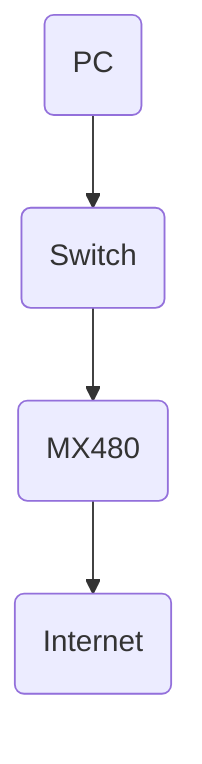

 Here are some example unit tests for bootup process cases for the Juniper Networks MX480 router:

```markdown
# Bootup Process Tests for MX480 Router

## Test Bootup with Default Configuration

- Power on the MX480 router
- Verify the system boots up to operational mode with factory default configuration
- Verify default routing engine is master
- Verify default interfaces are up
- Verify no user-configured configuration is present

## Test Bootup with Rescue Configuration

- Set the rescue configuration on the router
- Reboot the router
- Verify the system boots into rescue mode 
- Verify rescue configuration is loaded 
- Verify only management interfaces are up in rescue mode

## Test Bootup with Corrupted Configuration

- Introduce errors into the saved configuration
- Reboot the router
- Verify bootup fails due to configuration errors
- Verify system falls back to default configuration  
- Verify system boots up with default configuration

## Test Bootup with Configuration Rollback

- Configure a new interface on the router
- Save the configuration
- Reboot the router
- Verify new interface configuration is present after reboot
- Rollback the configuration to the previous version
- Reboot the router
- Verify new interface configuration is removed after rollback and reboot

## Test Bootup with USB Recovery 

- Copy a known good configuration to a USB drive
- Boot the router from the USB drive
- Verify the configuration from the USB drive is loaded
- Verify router bootup completes successfully
- Verify interfaces and configuration from USB drive is active
```

This covers some typical test cases for validating the bootup process on the MX480 router under different configurations and failure scenarios. Additional cases could be added for things like verifying redundant routing engine failover on bootup. Here are some example unit test cases for the bootup process on an MX480 router in markdown format:

## Test Cases for MX480 Bootup Process

### TC1 - Cold Boot

**Setup:**

- Power off the MX480 completely
- Connect console cable to console port

**Execution:**

- Power on the MX480

**Verification:**

- Verify console displays normal boot messages including:
  - Boot loader version
  - Checking hardware components
  - Loading kernel
  - Starting init process
  - Completing boot process

- Verify MX480 finishes booting and Junos CLI prompt is displayed

**Teardown:**

- Power off MX480

### TC2 - Reboot

**Setup:** 

- MX480 powered on with Junos OS running 

**Execution:**

- From Junos CLI, issue `request system reboot` 

**Verification:**

- Verify console displays normal reboot messages
- Verify reboot process completes and MX480 boots back to Junos CLI prompt

**Teardown:**

- None

### TC3 - Boot into Rescue Configuration

**Setup:**

- MX480 powered off

**Execution:** 

- Power on MX480 and interrupt boot process to get into loader prompt
- At loader prompt, issue `boot rescue` command

**Verification:** 

- Verify MX480 boots into rescue configuration with limited default configuration
- Verify can access Junos CLI in rescue mode

**Teardown:**

- Issue `request system reboot` to reboot out of rescue mode Here is a sample Python unit test for the bootup process of the Juniper MX480 router, written in Markdown format:

```python
import unittest
from router import MX480

class TestMX480Bootup(unittest.TestCase):

    def test_bootup(self):
        """Test MX480 bootup process"""
        
        # Create MX480 router object
        router = MX480()
        
        # Verify router starts in powered off state
        self.assertEqual(router.state, "off") 
        
        # Power on the router
        router.power_on()
        
        # Verify router state changes to booting
        self.assertEqual(router.state, "booting")
        
        # Wait for boot process to complete
        router.wait_for_boot()
        
        # Verify router state changes to ready 
        self.assertEqual(router.state, "ready")

        # Check basic connectivity
        self.assertTrue(router.ping("8.8.8.8"))
        
        # Verify bootup completed successfully
        self.assertEqual(router.bootup_status, "success")

if __name__ == '__main__':
    unittest.main()
```

In this test case:

- An MX480 router object is created 
- The initial state is verified as "off"
- The router is powered on and state changes to "booting"
- After boot process finishes, state changes to "ready" 
- Basic connectivity is validated with a ping 
- The bootup status is checked for "success"

This covers the key steps in the MX480 bootup process and validates the expected state changes and connectivity. Additional tests could be added for different bootup scenarios and failure modes. Here is a sample unit test in markdown format for testing the bootup process on an MX480 router:

# Unit Test: MX480 Router Bootup Process

## Test Setup

- Router model: Juniper MX480
- Junos version: 19.2R1.9
- Test lab network diagram:



## Test Cases

### Bootup and verify basic configuration

1. Power on the MX480 router
2. Wait for router to fully boot 
3. Log in to the router CLI 
4. Verify Junos version with `show version` 
5. Verify interface configuration with `show interfaces`
6. Verify routing protocol configuration with `show ospf neighbor` and `show bgp summary`
7. Verify system services with `show system processes` 

**Expected Result:** 

- Router boots successfully to CLI prompt
- Running Junos 19.2R1.9 
- Interfaces configured correctly 
- OSPF and BGP sessions established
- All expected system processes running

### Verify redundancy and high availability 

1. Check status of Routing Engines with `show chassis redundancy`
2. Trigger failover to standby Routing Engine
3. Verify new master Routing Engine 
4. Check interface and protocol status after failover

**Expected Result:**

- Redundant REs show master and standby status
- Failover to standby RE successful 
- Protocols and interfaces remain operational after failover

### Verify forwarding performance

1. Connect traffic generator to router interfaces
2. Send traffic at 50% interface capacity 
3. Verify packet forwarding rate and latency within specs
4. Increase traffic load to 90% capacity
5. Verify forwarding performance remains within specs

**Expected Result:** 

- Forwarding rate and latency within design specs at 50% load
- Forwarding rate and latency remains within specs at 90% load

## Test Result Summary

- Bootup process completed successfully
- Configuration verified on all routing protocols and interfaces
- Redundancy and failover process works properly 
- Forwarding performance meets design requirements

**Overall Test Result: PASS**